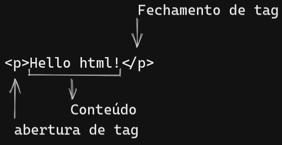
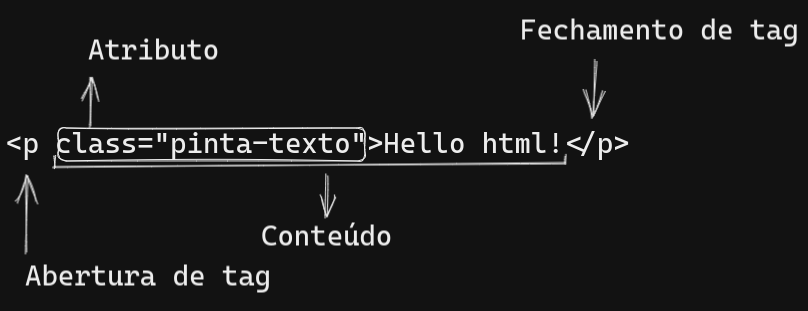
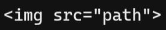

# Anatomia de uma tag

Em HTML a tag é usada para criar um elemento.
---

## Tag simples

## Tag com atributos

os atributos geralmente irão alterar o comportamento do conteúdo ou da tag.

Nesse caso o atributo é uma classe que ira alterar a cor do texto.

> **__Nota__**
>
> [Mais sobre tags](https://developer.mozilla.org/pt-BR/docs/Web/HTML/Attributes)

## Tag sem fechamento

Algumas tag não necessitam de fechamento, como é o caso da tag ``.

