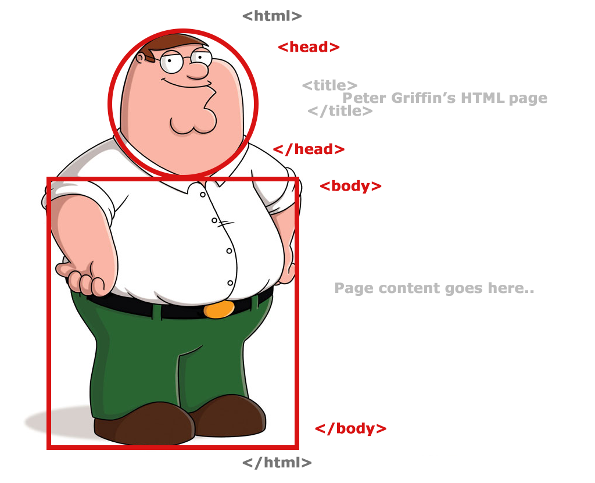

# Estrutuda básica de um HTML.



Como mostrado pelo nosso amigo Peter Griffin toda estrutura HTML começa com a tag `html` e dentro delas temos as tags `head` e `body`.

Então nosso HTML atualmente estará assim:

```html
<!DOCTYPE html>
<html lang="en">
  <head>
    <meta charset="UTF-8">
    <title>Document</title>
  </head>
  <body>
    
  </body>
</html>
```

Bom agora vem a explicação de cada elemento.

---

```html
<!DOCTYPE html>
```

O doctype. Nas névoas do tempo, quando o HTML era recente (por volta de 1991/2), doctypes funcionavam como links para uma série de regras as quais uma página HTML tinha que seguir para ser considerada uma página com um bom HTML, o que poderia significar a verificação automática de erros e outras coisas úteis.

---

```html
<!DOCTYPE html>
<html lang="en">
</html>
```
O elemento `<html>` envolve o conteúdo da página inteira e é conhecido como o "elemento raiz" da página HTML.

O atributo `lang="en"` Define o idioma usado no elemento.

---

```html
<!DOCTYPE html>
<html lang="en">
  <head>
    <meta charset="UTF-8">
    <title>Document</title>
  </head>
</html>
```

O elemento `<head>` atua como um container para todo o conteúdo da página HTML que não é visível para os visitantes do site. Isso inclui palavras-chave e a descrição da página que você quer que apareça nos resultados de busca, o CSS para estilizar o conteúdo da página (apesar de ser recomendado faze-lo num aquivo separado), declaração de conjunto de caracteres, e etc. Você aprenderá mais sobre isso no próximo artigo da série.

`<meta charset="utf-8">` Este elemento define o tipo da codificação dos caracteres que o seu documento deve usar, neste caso, para o tipo UTF-8, que inclui a maioria dos caracteres das linguas humanas escritas. Essencialmente, ele consegue lidar com qualquer tipo de conteúdo textual que você puder colocar no documento. Não há motivos para não indicar essa informação e esse elemento ajuda a evitar vários problemas na sua página.

O elemento `<title>`. Isto define o título de sua página, que aparecerá na guia do navegador na qual a página está carregada e é usado para descrevê-la quando for salva nos favoritos.

---

```html
<!DOCTYPE html>
<html>
  <head>
    <meta charrset="utf-8">
    <title>My first page.</title>
  </head>
  <body>
    Hello HTML.
  </body>
</html>
```

O elemento `<body>` contém todo o conteúdo que você quer mostrar aos usuários quando eles visitarem sua página, como texto, imagens, vídeos, jogos, faixas de áudio reproduzíveis, ou qualquer outra coisa.

---

