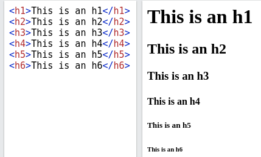

# 🔖 Tags de texto

---

## Tag `<p>`

O elemento HTML `<p>` representa um parágrafo.

Em mídias visuais, parágrafos são representados como blocos indentados de texto com a primeira letra avançada e separados por linhas em branco. Já em HTML, parágrafos são usados para agrupar conteúdos relacionados de qualquer tipo, como imagens e campos de um formulário.

```html
<p>Este é um parágrafo</p>
```

---

## Tags `<hx>`

Os elementos HTML `<h1>–<h6>` representam seis níveis de título de seção. `<h1>` é o nível de seção mais alto e `<h6>` é o mais baixo.

```html
<h1>Este é uum titulo</h1>
<h2>Este é uum titulo</h2>
<h3>Este é uum titulo</h3>
<h4>Este é uum titulo</h4>
<h5>Este é uum titulo</h5>
<h6>Este é uum titulo</h6>
```



---

## Tag `<br>`

O elemento HTML quebra-de-linha <br> produz uma quebra de linha em um texto (carriage-return).É útil para escrever poemas ou um endereço, onde a divisão de linha é significante.

```html
Texto um
<br>
Texto dois
```

---