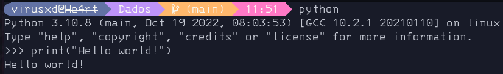
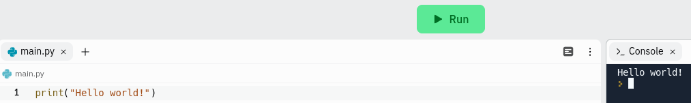

# 👋 Hello world!

Bom agora que nosso ambiente está preparado, iremos fazer o pontapé inicial de toda linguagem que é mostrar na tela a mensagem `Olá mundo!` ou `Hello world!`.

-  No console interativo do python:

    Basta em seu terminal digitar `python` ou `python3` e digitar o seguinte código:

    ```python
    print("Hello world!")
    ```

    A saída será assim:

    <details>
      <summary>
        Ilustração
      </summary>

    

    </details>

    > **__Nota:__**
    >
    > Para sair do console interativo basta digitar:
    >
    > `exit()`

- 🌐 Na web:

    Para executar na web optei por usar o  [Replit](https://replit.com/).

    O código continuará o mesmo:

    ```python
    print("Hello world!")
    ```

    A saída será assim:

    <details>
      <summary>
        Ilustração
      </summary>

    

    </details>

-  Em um arquivo `.py`.

    basta você criar um arquivo com nome `.py`.

    O código continuará o mesmo:

    ```python
    print("Hello world!")
    ```

    <details>
      <summary>
        Ilustração
      </summary>

    

    </details>

---

> **__AVISO:__**
>
> Aqui mostrei diferentes formas de ver uma saida no python, mas daqui pra frente irei usar somente a forma de arquivo.

> **__Observação:__**
>
> A função `print()` será uma grande aliado em nossa caminhada de desenvolvedor.

> **__Nota:__**
>
> Caso queira saber mais sobre a função [`print()`](https://docs.python.org/pt-br/3/library/functions.html#print)