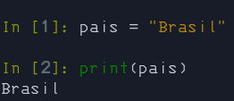
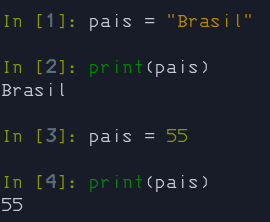
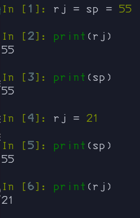
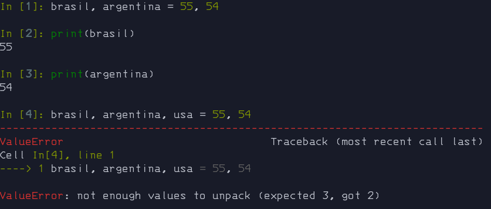

# 📦 Variáveis

Na programação, uma variável é um objeto (uma posição, frequentemente localizada na memória) capaz de reter e representar um valor ou expressão.

- variável é um item de dados nomeado cujo valor pode ser alterado durante a execução do programa.

Nos casos a seguir irei usar o modo interativo, mas não o padrão do python, irei usar o [Ipython](https://ipython.org/).

---

- Variável simples.

    Em python para criarmos uma variável é extremamente simples.

    ```python
    pais = "Brasil"
    ```

    simples, sem necessidade de palavra reservada.

    <details>
      <summary>
        Ilustração
      </summary>

    

    </details>

---

- Sobrescrição de variavel.

    No python para sobrescrever uma variável basta "escreve-la novamente".

    ```
    pais = "Brasil"
    pais = 55
    ```

    Álem de ter alterado o valor, também alteramos o tipo dela. Veremos mais sobre tipos do python na proxima secção. 

    <details>
      <summary>
        Ilustração
      </summary>

    

    </details>

---

- Variável encadeada.

    É a atribuição de uma mesmo valor para multiplas variaveis.

    Caso uma sofra alteração, a outra não irá sofrer.


    ```python
    rj = sp = 55
    ```

    <details>
      <summary>
        Ilustração
      </summary>

    

    </details>

---

- Desenpacotamento de valores em variáveis.

    Irei falar mais sobre desempacotamento quando entrar no assunto de iteráveis.

    Caso você tente desempacotar um número maior de variáveis do que atribuições ele irá exibir um erro.

    ```python
    brasil, argentina = 55, 54
    ```

    <details>
      <summary>
        Ilustração
      </summary>

    

    </details>

---

## β Constantes

Em linguagens de programação, constantes são usadas em expressões para representar vários tipos de valores.

- Uma constante é um item de dados nomeado com um valor predefinido(fixo).

```python
BASE_URL = "https://google.com"
```

---

## 🧔 Nomeando variáveis e constantes

Para nomear variáveis no python é usado uma conveção chamada `Snake Case`.

Varias podem ser nomeadas apenas com letras e números, sem caracteres especiais.

`Snake Case` - Consiste na separação de palavras usando sobre linhas.

- Variável com um unico substantivo(nome).

    ```python
    pais = "Brasil"
    ```

- Variável com mais de um substantivo(nome).

    ```python
    pais_sul_america = "Argentina"
    ```

- Variável com número.

    ```python
    pais_55 = "Brasil"
    ```

### β Constantes

Para nomeação de constantes usamos o padrão `SCREAMING SNAKE CASE`

`SCREAMING SNAKE CASE` - Consiste na separação de palavras usando sobre linhas e as palavras maiúsculas.

```python
BASE_URL = "https://google.com"
```

## 🚷 - Palavras reservadas

É recomendado não usar algumas palavras como nome de variável, pois o python as usa para fazer algum dentro da propria linguagem, são elas:

|and|as|assert|async|
|:---:|:---:|:---:|:---:|
|await|break|case|class|continue|
|def|del|elif|else|except|False|
|if|import|in|is|lambda|
|match|None|nonlocal|not|or|
|pass|raise|return|True|try|
|while|with|yield|||

```python
is = False #Não recomendado

is_even = True #Recomendado
```