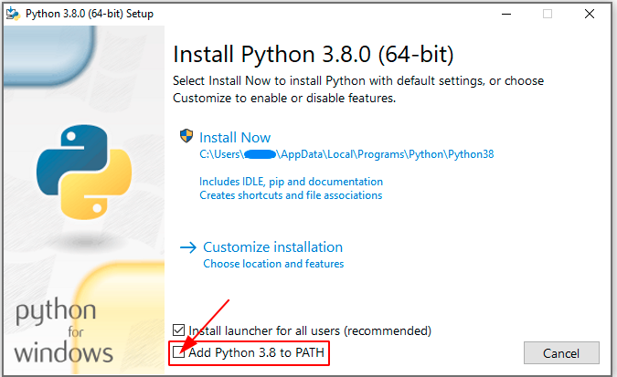

# 🖥️ Ambiente de desenvolvimento

É recomendado a instalação do python em seu computador, mas a maneiras de executa-lo através de seu navegador.

## ⚙️ Instalação do python

###  Linux

No linux e comum o python já vir instalado, para verificar isso basta executar o comando:

```bash
python --version
```

ou

```
python3 --version
```

<details>
  <summary>
    Ilustração
  </summary>
  

  Por no meu ambiente eu ter buildado o python quando digito `python --version`, ele aparece `3.10.8`, pode ser que no computador apareça 2.7.x que é uma versão que já vem instalada no linux.

  
</details>

Para instala-lo basta executar os seguintes comandos.

```bash
sudo apt install python3
```

```bash
sudo apt install python3-pip
```

> **__Nota__**:
>
> Caso seu linux use outro gerenciador de pacotes, aconselho olha na documentação de seu sistema como instalar o python.

---

###  Windows

Basta baixar o executavel em [Python.org](https://www.python.org/downloads/windows/)

e começar uma instalação padrão no windows.
É recomendado que você escolha a instação padrão.

> Observação:
>
> Lembre-se de marcar essa caixinha, caso contrario quando você tentar executar o comando `python --version` ou `python3 --version` no prompt ele não irá funcionar.
>
> 

Por fim execute o comando abaixo, para verificar se tudo foi instalado corretamente.

```bash
python --version
```

ou

```
python3 --version
```

> **__Nota__**:
>
> No windows talvez seja necessario a reinicialização do computador após a instalação para os comandos funcionarem.

<details>
  <summary>
    Ilustração
  </summary>
  

  Por no meu ambiente eu ter buildado o python quando digito `python --version`, ele aparece `3.10.8`, pode ser que no computador apareça 2.7.x que é uma versão que já vem instalada no linux.

  
</details>

---

### 💻 Mac OS.

Usando gerenciador de pacotes [brew](https://brew.sh/index_pt-br).

```bash
brew install python3
```

Por fim execute o comando abaixo, para verificar se tudo foi instalado corretamente.

```bash
python --version
```

 ou

```
python3 --version
```

<details>
  <summary>
    Ilustração
  </summary>
  

  Por no meu ambiente eu ter buildado o python quando digito `python --version`, ele aparece `3.10.8`, pode ser que no computador apareça 2.7.x que é uma versão que já vem instalada no linux.

  
</details>

---

> **__Nota:__**
>
> Caso ocorra algum problema durante sua instalação você pode acessar o site oficial do [Python](https://www.python.org/downloads/) ou procure suporte para seu sistema.

---

## 🌐 Web

Nos links abaixo você poderá executar seus codigos python sem a necessidade de instalar-lo em seu computador.

###  [Replit](https://replit.com/)

###  [Jupyter](https://jupyter.org/)

---

## 🗒️ Editores de texto

Aconselho o uso de um editor de texto para escrever seus códigos python.

> **__Nota:__**
>
> Todo arquivo python vai terminar com `.py`
>
> Caso veja algum arquivo `.ipynb` é do jupyter notebook que roda python por trás dos panos.
>
> ex: `hello_world.py`


 [VSCode](https://code.visualstudio.com/)

 [PyCharm](https://www.jetbrains.com/pt-br/pycharm/)

 [Sublime](https://www.sublimetext.com/)