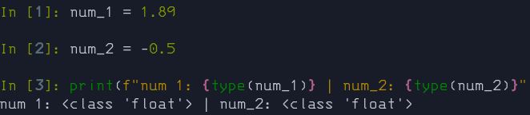
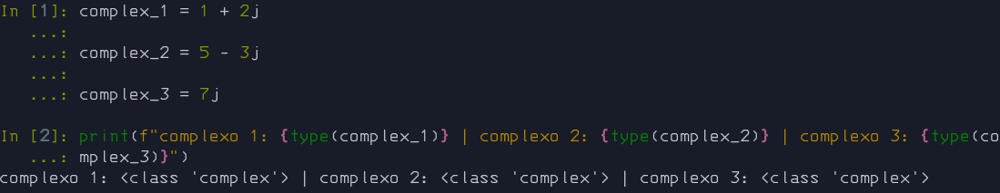

# 🔢 Tipos Numéricos

Existem três tipos numéricos distintos: inteiros, números de ponto flutuante e números complexos.

Python suporta completamente aritmética mista: quando um operador de aritmética binária tem operandos de tipos numéricos diferentes, o operando com o tipo “mais estreito” é ampliado para o tipo do outro operando, onde um inteiro é mais estreito do que um ponto flutuante, que por sua vez é mais estreito que um número complexo.

**__Todos os tipos númericos são <span style="color: red;">Imutaveis</span>__**

---

## `int` - Inteiro

O inteiro é um tipo composto por caracteres numéricos (algarismos) inteiros.

É um tipo usado para um número que pode ser escrito sem um componente decimal, podendo ter ou não sinal, isto é: ser positivo ou negativo.

```python
num_1 = 310

num_2 = -310
```

<details>
  <summary>Ilustração</summary>


</details>

---

## `float` - Ponto Flutuante

O ponto flutuante é um tipo composto por caracteres numéricos (algarismo) decimais.

O famoso ponto flutuante é um tipo usado para números racionais (números que podem ser representados por uma fração) informalmente conhecido como “número quebrado”.

```python
num_1 = 1.89

num_2 = -0.5
```

<details>
  <summary>Ilustração</summary>



</details>

---

## `complex` - Complexo

Tipo de dado usado para representar [números complexos](https://pt.wikipedia.org/wiki/N%C3%BAmero_complexo).

Esse tipo normalmente é usado em cálculos geométricos e científicos.

Um tipo complexo contem duas partes: a parte real e a parte imaginária, sendo que a parte imaginária contem um j no sufixo.

```python
complex_1 = 1 + 2j

complex_2 = 5 - 3j

complex_3 = 7j
```

<details>
  <summary>Ilustração</summary>



</details>

---

## Operadores

|Operação|Resultado|
|:---:|:---:|
|`x + y`|soma de `x` e `y`|
|`x - y`|diferença de `x` e `y`|
|`x * y`|produto de `x` e `y`|
|`x / y`|divisão de `x` por `y`|
|`x // y`|divisão inteira de `x` por `y`|
|`x % y`|resto da divisãode `x` por `y`|
|[`abs(x)`](https://docs.python.org/pt-br/3/library/functions.html#abs)|valor absoluto ou magnitude de `x`|
|[`int(x)`](https://docs.python.org/pt-br/3/library/functions.html#int)|`x` convertido em inteiro|
|[`float(x)`](https://docs.python.org/pt-br/3/library/functions.html#float)|`x` convertido em ponto fluente|
|[`complex(re, im)`](https://docs.python.org/pt-br/3/library/functions.html#complex)|um número complexo com parte real `re`, parte imaginária `im`. `im` tem como padrão zero.|
|`c.conjugate`|conjugado do número complexo `c`|
|[`divmod(x, y)`](https://docs.python.org/pt-br/3/library/functions.html#divmod)|o par (`x` // `y`, `x` % `y`)|
|[`pow(x, y)`](https://docs.python.org/pt-br/3/library/functions.html#pow)|`x` elevado a `y`|
|`x ** y`|`x` elevado a `y`|