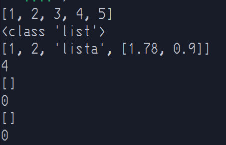
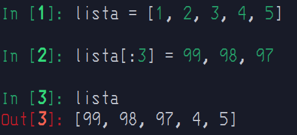
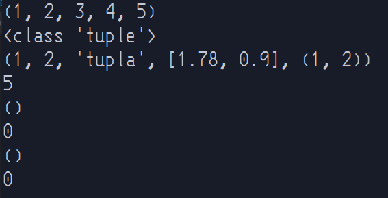

# Sequências

Elas representam conjuntos ordenados finitos indexados por números não negativos. A função embutida [len()](https://docs.python.org/3/library/functions.html#len) retorna o número de itens de uma sequência. Quando o comprimento de uma sequência é n, o conjunto de índices contém os números 0, 1, …, n-1. O item i da sequência a é selecionado por a[i].

> **__Observação__**
>
> [String](./strings.md) é uma sequencia também e tem uma secção só para ela.

---

## `list` - Listas

Listas agrupam um conjunto de elementos variados, podendo conter: inteiros, floats, strings, outras listas e outros tipos.

As listas são formadas colocando uma lista separada por vírgulas de expressões entre colchetes.

índices de listas vão de `[0, n]`, sendo `0` o primeiro e `n` o tamanho da lista - 1(`len(<list>) -1`).

> **__Listas são <span style="color: green;">Mutáveis</span>__**

```python
lista_1 = [1, 2, 3, 4, 5]
lista_2 = [1, 2, "lista", [1.78, 0.9]]
lista_3 = []
lista_4 = list()
```

<details>
  <summary>Ilustração</summary>



> **__Observação__**
>
> Lembre-se sempre de usar as funções `print()`, `type()` e `len()`

</details>

>Observação
>
>Quando for usado `<list>` estarei falando propriamente de uma lista ou uma referência a uma.

### 🔪 Fatiamento(slicing).

|Operação|Função|
|:---:|:---:|
|`<list>[i]`|Acessa o valor de da lista na posição `i`|.
|`<list>[i:j]`|Fatia a lista da posição `i` até `j - 1`|
|`<list>[i:j:k]`|Fatia a lista da posição `i` até `j - 1` pulando `k - 1` valores|
|`del <slicing>`|Deleta os valores do slicing|

> **__Observação:__**
>
> Slicing suporta operação de sobrescrição, mas para cara valor da slice tem que ter o mesmo valor da sobrescrição.
>
> <details><summary>Exemplo</summary>
</details> 


### 🪛 Operações

|Operação|Função|Equivalência com lógica|
|:---:|:---:|:---:|
|`<list>.append(x)`|Adiciona x ao final da lista|`<list>[len(list):len(list)] = [x]`|
|`<list>.clear()`|Remove todos os itens de uma lista|`del <list>[:]`|
|`<list>.copy()`|Cria uma copia superficial de uma lista|`<list>[:]`|
|`<list>.extend(<list_x>)` ou `<list> += <list_x>`|Junta duas listas|`<list>[len(list):len(list)] = <list_x>`|
|`<list> *= n`|Repete e reatribui uma lista `n` vezes||
|`<list>`.insert(i, x)|Inseri um valor `x` na posição `i`|<list>[i:i] = [x]|
|`<list>.pop()` ou `<list>.pop(i)`|Retorna o valor em `i` e remove-o da lista, caso o `i` não seja especificado remove o ultimo item da lista||
|`<list>.remove(x)`|Remove a primeira incidência de de `x`||
|`<list>.reverse()`|Inverte os itens da lista||
|[`<list>.sort(key, reverse=False)`](https://docs.python.org/pt-br/3/library/stdtypes.html#list.sort)|Ordena uma lista por padrão do menor para o maior, `key` uma função para ser usada sobre a lista, `reverse` reverte a lista||
|`<list>.count(x)`|Conta quantas vezes `x` aparece na lista||

---

## `tuple` - tupla

Assim como Lista, Tupla é um tipo que agrupa um conjunto de elementos.

Porém sua forma de definição é diferente: utilizamos parênteses e também separado por vírgula.

É possível fazer `slicing` com tuplas também, mas por ser imutável não é possível a reatribuição. 

> Tuplas são Imutáveis

```python
tupla_1 = (1, 2, 3, 4, 5)
tupla_2 = 1, 2, "tupla", [1.78, 0.9], (1, 2)
tupla_3 = ()
tupla_4 = tuple()
```

<details>
  <summary>Ilustração</summary>



</details>

### 🪛 Operações

|Operação|Função|
|:---:|:---:|
|`<tuple>.count(x)`|Conta quantas vezes `x` aparece na tupla|
|`<tuple>.index(x)`|Retorna a índice que o valor `x` esta na tupla, se não um erro(ValueError)|

---

## `range` - intervalo

O tipo range representa uma sequência  de números e é comumente usado para percorrer um número determinado de vezes em um laço for, veremos sobre for em estrutura de repetição.

É possível fazer slicing com range também, mas não sobrescrição.

> **__Ranges são imutáveis__**

```python
interval = range(5)
interval_2 = range(2, 5)
interval_3 = range(-1, -10, -2)
```

> **__Observação:__**
>
> Toda vez que foi falado que algum tipo sequência não suporta sobrescrição é enquanto tratado como container, lembrando que a variável pode ser sobrescrita a qualquer momento.

