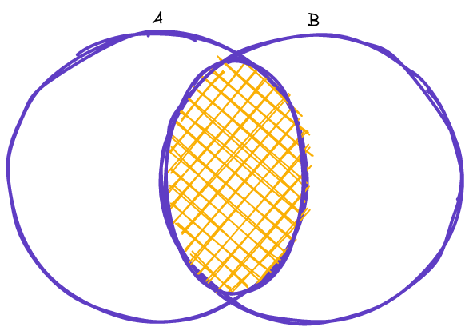
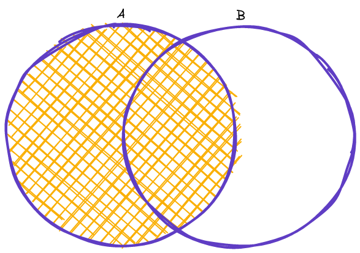
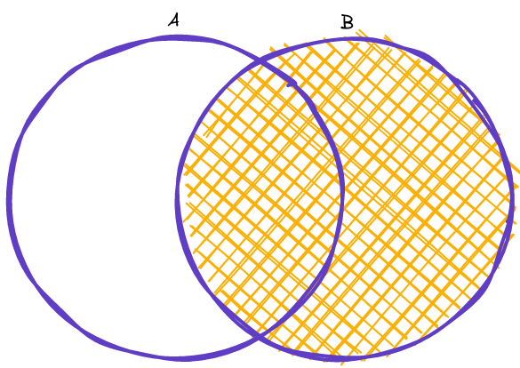
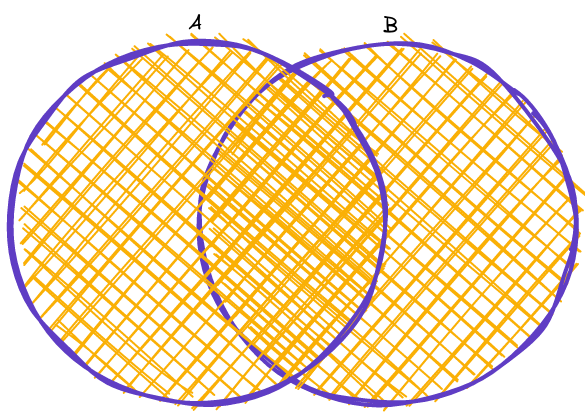

# 🪛 `DML` - Data Manipulation Language

Uma linguagem de manipulação de dados (DML) permite aos usuários acessar ou manipular dados conforme organizados pelo modelo de dados apropriado. Compõe uma única linguagem de consulta banco de dados, como por exemplo, o SQL. Se assemelha a uma linguagem simples (do inglês) e torna fácil a interação do usuário com o sistema de banco de dados. 

DML fornece comandos para que os usuários consigam manipular dados em um banco de dados. A manipulação envolve inserir, recuperar, excluir e atualizar dados em tabelas de banco de dados.  

Veja abaixo os comandos e o que eles fazem: 

|SELECT|recupera informações armazenadas no banco de dados.|
|:---:|:---:|
|INSERT|adiciona novas informações no banco de dados.|
|UPDATE|altera informações armazenadas no banco de dados.|
|DELETE|deleta informações do banco de dados.|

---

## Ordem de execução.

1. `FROM`

2. `WHERE`

3. `GROUP BY`

4. `HAVING`

5. `SELECT`

6. `ORDER BY`

7. `LIMIT`

---

## Interação

- `SHOW DATABASES;`

    - Mostra todos os banco de dados.

- `USE <db_name>;`

    - Seleciona um banco de dados.

- `SHOW TABLES;`

    - Mostra todas as tabelas.

- `DESCRIBE <table_name>`

    - Mostra a descrição da tabela.

---

## `INSERT`

Insere valores em uma tabela

- `INSERT INTO <table_name> (<column>) VALUES (<value>);`

    - Insere um único valor em uma tabela.

- `INSERT INTO <table_name> (<column_1>, <column_2>, <column_n>) VALUES (<value_1>, <value_2>, <value_n>);`

    - Insere multiplos valores em uma tabela.

- `INSERT INTO <table_name> (<column_1>, <column_2>, <column_n>) SELECT (<column_1>, <column_2>, <column_n>) FROM <target_table>;`

    - Insere valores em uma tabela, que vieram de outra tabela

---

## `SELECT`

Seleciona colunas de uma tabela.

- `SELECT <column_1>, <column_2>, <column_n> FROM <table_name>;`

    - Seleciona valores de uma tabela.

    - Pata seleciona todos basta usar um `*`.

        - ex:

            `SELECT * FROM <table_name>;`

- `SELECT <column_1>, <column_2>, <column_n> FROM <table_1>, <table_2>, <table_n>;`

    - Seleciona valores de diferentes tabelas.

    - Ocorre o mesmo problema que em [álgebra relacional](../relational_algebra.md) na parte de plano cartesiano.

- `SELECT DISTINCT <column_1>, <column_2>, <column_n> FROM <table_name>;`

    - Seleciona só valores diferentes.

---

## `Delete`

Deleta valores de uma tabela.

- `DELETE FROM <table_name> WHERE <condition>;`

    - Quando o comando `DELETE` for usado e extremamente recomendado o uso da Clause `WHERE`, caso contraio poderá deletar a tabela toda e não só um campo.

---

## `UPDATE`

Modifica valores em uma tabela.

- `UPDATE <table_name> SET <column_1> = <value_1>, <column_2> = <value_2>, <column_n> = <value_n> WHERE <condition>;`

    - Quando o comando `UPDATE` for usado e extremamente recomendado o uso da Clause `WHERE`, para identificar qual linha deve ser alterada.

---

## JOINS

É usado para combinar linhas de duas ou mais tabelas, baseado na coluna de ligação(colunas com mesmo nome).

- Todo `ON` nos joins são as clausulas de ligação(o que há em ambas tabelas).

### `INNER JOIN`

Um `INNER JOIN` entre duas tabelas resultara em uma tabela onde os valores da tabela_1 é igual ao da tabela_2.

- `SELECT <column_names(s)> FROM <table_1> INNER JOIN <table_2> ON <table_1>.<column_name> = <table_2>.<column_name>;`

  
Exemplo

`SELECT LIVROS.NOME_LIVRO, ESTOQUE.QTD_ESTOQUE FROM LIVROS INNER JOIN ESTOQUE ON LIVROS.ID_LIVRO = ESTOQUE.ID_LIVRO; `

### `LEFT JOIN`

Um `LEFT JOIN` irá retornar todos registros da tabela_1(tabela a esquerda) e os elemendos oriundos da interseção das duas tabelas.

- `SELECT <column_name(s)>
FROM <table_1>
LEFT JOIN <table_2>
ON <table_1>.<column_name> = <table_2>.<column_name>;`

  
Exemplo

`SELECT Customers.CustomerName, Orders.OrderID
FROM Customers
LEFT JOIN Orders ON Customers.CustomerID = Orders.CustomerID
ORDER BY Customers.CustomerName;`

### `RIGHT JOIN`

Um `RIGHT JOIN` irá retornar todos registros da tabela_2(tabela a direita) e os elemendos oriundos da interseção das duas tabelas.

- `SELECT <column_name(s)>
FROM <table_1>
RIGHT JOIN <table_2>
ON <table_1>.<column_name> = <table_2>.<column_name>;`

  
Exemplo

`SELECT Orders.OrderID, Employees.LastName, Employees.FirstName
FROM Orders
RIGHT JOIN Employees ON Orders.EmployeeID = Employees.EmployeeID
ORDER BY Orders.OrderID;`

### `FULL JOIN`

Um `FULL JOIN` irá retornar todos registros da tabela_1 e da tabela_2.

- `SELECT <column_name(s)>
FROM <table_1>
FULL OUTER JOIN <table_2>
ON <table_1>.<column_name> = <table_2>.<column_name>
WHERE <condition>;`

  
Exemplo

`SELECT Customers.CustomerName, Orders.OrderID
FROM Customers
FULL OUTER JOIN Orders ON Customers.CustomerID=Orders.CustomerID
ORDER BY Customers.CustomerName;`

---

## Clauses

|`Clause`|`Função`|`Exemplo`|
|:---:|:---:|:---:|
|`AS`|Renomeia uma coluna ou tabela com alias(apelido).|`SELECT <column_1> AS <alias_1>, <column_2> AS <alias_2> FROM <table_name>;`|
|`WHERE`|Filtra a consulta com uma condição.|`SELECT <field> FROM <table> WHERE <condition>;`|
|`AND`|É usado com o `WHERE` para linhas onde ambas condições são verdadeiras.|`SELECT <field> FROM <table> WHERE <condition> AND <condition>;`|
|`BETWEEN`|É usado para selecionar valores para um dado intervalo, o valor pode ser do tipo `NUMBER`, `TEXT` ou  `DATES`.|`SELECT <fields> FROM <table> WHERE <condition> BETWEEN <start> AND <stop>;`|
|`IN`|Especifica multiplos valores, quando `WHERE` for usado.|`SELECT first_name, last_name, email  FROM users WHERE id in (10, 100, 90);`|
|`ORDER BY`|É usado para ordenar uma seleção.|`SELECT <column_1>, <column_2>, ... FROM <table_name> ORDER BY <column_1> <column_2>, ... ASC\|DESC;`|
|`GROUP BY`|É usado para agrupar linhas com mesmo valor.|`SELECT column_name(s) FROM table_name WHERE condition GROUP BY column_name(s) ORDER BY column_name(s);`|
|`LIMIT`|É usado para limitar uma seleção.|`SELECT <column> FROM <table_name> LIMIT <value>;`|
|`OFFSET`|É usado para paginação quando usado com `LIMIT`.|`SELECT <column> FROM <table_name> LIMIT <value> OFFSET <value>;` ou `SELECT <column> FROM <table_name> LIMIT <offset_value>, <limit_value>; `|

### `LIKE`

É usado junto com `WHERE` para pesquisar um padrão em uma coluna.

`SELECT <column_1>, <column_2>, ... FROM <table_name> WHERE <column> LIKE <pattern>;`

- `LIKE` operatos

    - O sinal de porcentagem (`%`) representa nenhum, um ou multiplo caracteres.

    - O sinal de sobrelinha (`_`) representa um único caractere.

    |Like Operator|Descrição|
    |:---:|:---:|
    |`WHERE <column> LIKE 'a%'`|Encontra qualquer valor que comece com "a".|
    |`WHERE <column> LIKE '%a'`|Encontra qualquer valor que termine com "a".|
    |`WHERE <column> LIKE '%or%'`|Encontra qualquer valor que  contenha "or".|
    |`WHERE <column> LIKE '_r%'`|Encontra qualquer valor que tenha "r" na segunda posição,|
    |`WHERE <column> LIKE 'a_%'`|Encontra qualquer valor que comece com "a" e tenha de tamanho 2,|
    |`WHERE <column> LIKE 'a__%'`|Encontra qualquer valor que comece com "a" e tenha tamnho 3,|
    |`WHERE <column> LIKE 'a%o'`|Encontra qualquer valor que comece com "a" e termine com "o".|

---

## Funções

|Função|Descrição|Exemplo|
|:---:|:---:|:---:|
|`CONCAT()`|Soma duas os mais expressões.|CONCAT(`<expression_1>, <expression_2>, <expression_3>, ...)`|
|`RAND()`|Gera um número aleatório.|`SELECT RAND();`|
|`ROUND()`|Arredonda um número decimal, dada a casa decimal.|`ROUND(number, decimals)`|
|`MIN()`|Retorna o menor valor dado uma coluna.|`SELECT MIN(<column_name>) FROM <table_name> WHERE <condition>;`|
|`MAX()`|Retorna o maior valor dado uma coluna|`SELECT MAX(<column_name>) FROM <table_name> WHERE <condition>;`|
|`COUNT()`|Essa função conta todas as reincidencias de algo em uma dada tabela.|`SELECT COUNT(<column_name>) FROM <table_name> WHERE <condition>;`|
|`AVG()`|Faz a média de uma coluna.|`SELECT AVG(<column_name>) FROM <table_name> WHERE <condition>;`|
|`SUM()`|Soma todos os valores de uma coluna.|`SELECT SUM(<column_name>) FROM <table_name> WHERE <condition>;`|