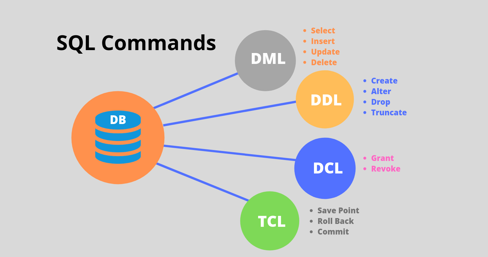

#  SQL - Structured Query Language.

SQL é uma sigla em inglês para Structured Query Language que pode ser livremente traduzida para Linguagem de Consulta Estruturada e é uma linguagem padrão para trabalhar com bancos de dados relacionais.

  
Mais sobre SQL

 
Ela surgiu nos anos 70 com a IBM, como uma alternativa dos bancos sequenciais, que eram uma lista de tabelas que não tinha relação entre si. Com o passar do tempo sofreu dificuldades para realizar a inclusão, alteração, exclusão de dados e outras necessidades, aumentando a complexidade do manuseio de banco de dados.

Após os bancos sequenciais, vale lembrar o surgimento da álgebra relacional como uma outra alternativa para interagir com bancos de dados relacionais. No entanto, ainda havia barreiras na perpetuação e compreensão de todas as expressões matemáticas usadas em álgebra relacional.

Para entender a melhor maneira de trabalhar dados estruturados, os laboratórios da IBM vieram com as primeiras versões do SQL. Mas quando outras empresas também começaram a trabalhar nisso, um órgão americano de padrões, o American National Standards Institute (ANSI), resolveu unificar todas as iniciativas sobre o movimento do banco de dados SQL promovendo um padrão que, de início, chamou-se de SEQUEL (Structured Query Language) ou seja, Linguagem de Consulta Estruturada em inglês. Já no Brasil, esse termo se popularizou com o nome de SQL.

A padronização da linguagem que trabalha com dados estruturados trouxe uma série de vantagens, dentre elas podemos citar a facilidade no aprendizado, já que a linguagem SQL se aproxima de frases da língua inglesa. Outra vantagem é o surgimento de vários outros sistemas de gerenciamento de banco de dados que usam a Linguagem SQL. Com o padrão ANSI, a Oracle começou a dar suporte à linguagem SQL, a Microsoft também, com o SQL Server, também passou a adotar o SQL como padrão, facilitando a integração de sistemas, mesmo de SGBDs diferentes.

Vale ressaltar que atualmente a linguagem SQL tem suas limitações. Em tempos de redes sociais e big data, surgiu a possibilidade de analisar dados não-estruturados, como grafos e imagens, pelo fato da modelagem relacional exigir chaves primárias e estrangeiras, acaba trazendo uma iniciativa um pouco engessada e para suprir a necessidade de análise e armazenamento de dados não-estruturados o NoSQLs é a melhor alternativa.

É possível compreender que a linguagem SQL prevaleceu quando se diz respeito a modelos estruturados e com a padronização ANSI surgiram várias facilidades para empresas e desenvolvedores. Contudo, mesmo com desvantagens, o banco de dados relacional ainda é campeão para gerir o pagamento e recebimento de uma empresa, controlar o fluxo de produção e modelar quaisquer processos repetitivos.

## [🏗️ `DDL` - Data Definition Language](./ddl.md)

## [🪛 `DML` - Data Manipulation Language](./dml.md)