# 📖 Modelo conceitual

## ⬜ Entidades:

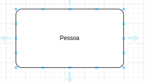

- São objetos únicos no mundo real.

- Entidades geralmente são nomeadas com substantivos.

`ex:`

Carro, livro, produtos, pessoa, departamento, ...

#### Entidades Forte:

- Existem independente de outras entidades.

- Entidades Fortes são representadas por retangul.

- Tem pk(primary key) chave primaria.

  
Exemplo

#### Entidades Fracas:

- Dependem da existencia de outras entidades.

- Entidades fracas são representadas por um retangulo com bordas.

- Tem fk(foreign key) chave estrangeira.

  
Exemplo

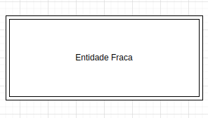

## 💑 Relacionamentos

Relacionamento entre entidades é o tipo de ocorrência existente entre entidades e aplicáveis no processo de modelar dados. Entender isso é importante pois um modelo consistente é a base para um banco de dados de sucesso. 

- O símbolo que representa o relacionamento no Modelo de Entidade e Relacionamento (MER) é um **losango** com o nome do relacionamento escrito no seu interior, como no exemplo a seguir.

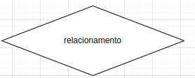

### Relancionamento binário:

Uma entidade se relaciona com outra.

  
Exemplo

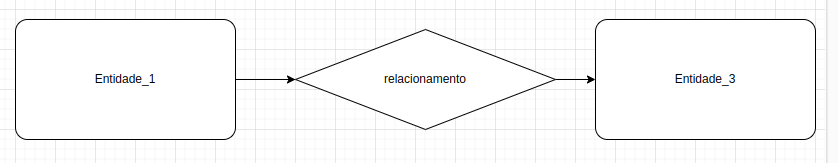

### Relacionamento Ternário:

Três entidades se relacionam entre si.

  
Exemplo

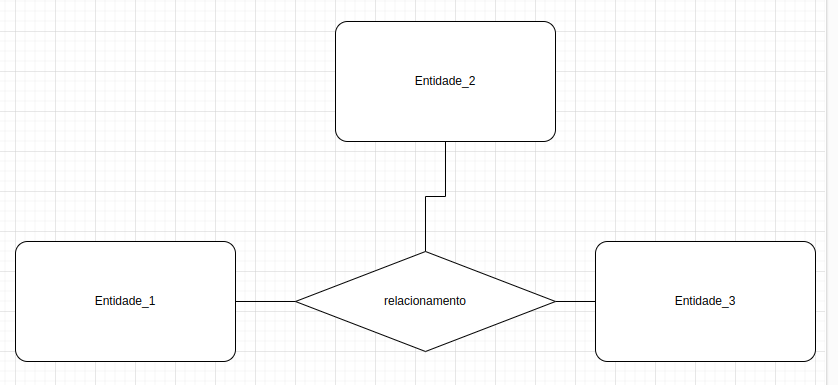

### Relacionamento N-ário:

Quando quatro ou mais entidades se relacionam entre si.

  
Exemplo

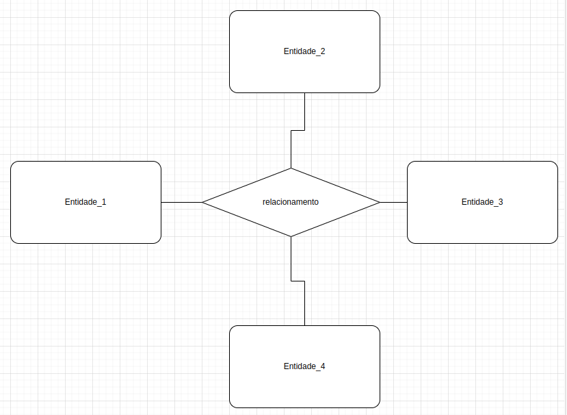

### Cardinalidade:

- Caracterizam-se pelo número mínimo e máximo de ocorrências de uma entidade associada a ocorrências de outra entidade.

### Um para um (`1:1`)

Duas entidades se relacionam exclusicamente.

  
Exemplo

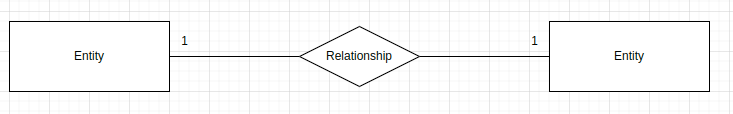

### Um para muitos (`1:n`)

Uma entidade se relaciona com n entidades.

  
Exemplo

### muitos para muitos (`n:m`)

n entidades se relacionam entre si.

  
Exemplo

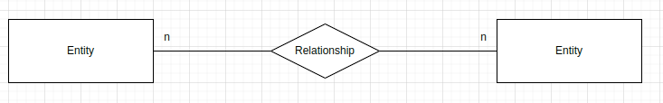

### Cardinalidade mínima e máxima.

É importante saber que os valores que estão ao lado da entidade ditam as regras de como as outras entidades irão se comportar diante de um relacionamento.

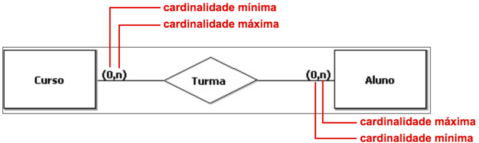

## Entidade Associativa.

  
Entidade Associativa

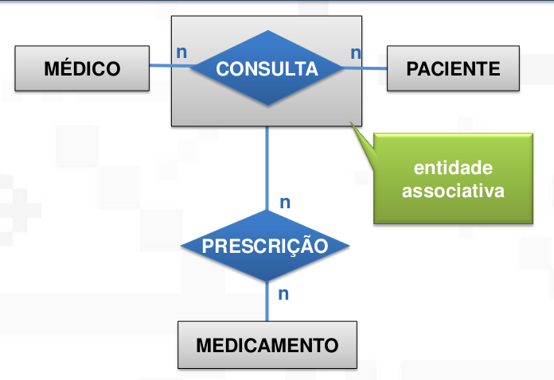

  
Tabela intermediária de relacionamentos

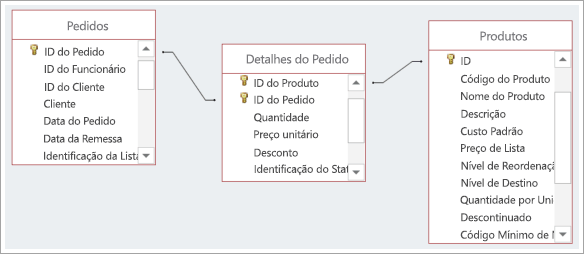

A Tabela intermediária de relacionamentos N para N é a tabela gerada no mapeamento conceitual-lógico de cardinalidades N para N. Todo relacionamento N:N gera uma tabela no mapeamento.

A Entidade Associativa é quando o relacionamento com cardinalidade N:N entre duas entidades precisa se relacionar com uma terceira entidade. Nesses casos, esse relacionamento precisaria estar conectado a alguma representação gráfica (ou a uma entidade ou a um relacionamento). Caso seja nas entidades, os vínculos são perdidos e caso seja no relacionamento, a modelagem estaria errada pois não é possível que dois relacionamentos estejam conectados entre si. Para isso, é feito o retângulo em volta do relacionamento. Vejamos um exemplo:

## ⚪ Atributos

Os atributos descrevem as propriedades das entidades. A entidade pessoa pode ter como atributo o nome, data de nascimento, idade, endereço. Como as entidades, também existem alguns tipos de atributos, que são: os atributos simples, atributos compostos, atributos multivalorados, atributos derivados e atributos chave. Agora veremos cada um deles:

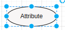

### Tipos de atributos:

  

    Atributo simples
  

  Atributos simples são indivisíveis, ou seja, são atributos atômicos, um exemplo seria o atributo `CPF`, ele não pode ser dividido em partes menores para formar outros atributos, ele é indivisível.

  

    Atributo composto
  

  Atributos Compostos podem ser divididos em partes menores, que representam outros atributos, como o atributo endereço, ele pode ser subdividido em atributos menores, como, por exemplo, `cidade`, `estado`, `rua`, `CEP`.

  

    Atributo multivalorado
  

  Um atributo Multivalorado pode ter um ou N (vários) valores associados a ele, como, por exemplo, o atributo telefone de um cliente, ele pode ter um ou vários telefones.

  

    Atributo derivado
  

  Atributos derivados dependem de outro atributo ou até mesmo outra entidade para existir, como, por exemplo, o atributo idade e o atributo data de nascimento, para descobrimos a idade de uma pessoa precisamos da sua data de nascimento, então, consideramos o atributo idade como derivado do atributo data de nascimento.

  

    Atributo chave
  

  O atributo chave é utilizado para identificar de forma única uma entidade, ou seja, os valores associados a esse atributo são distintos dentre o conjunto de entidades. Como exemplo, podemos utilizar o `CPF` de uma pessoa, ele é único e pode ser utilizado como atributo chave, já que cada pessoa recebe um número de `CPF` distinto.

  

    Atributo de especialidade
  

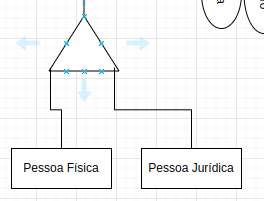

