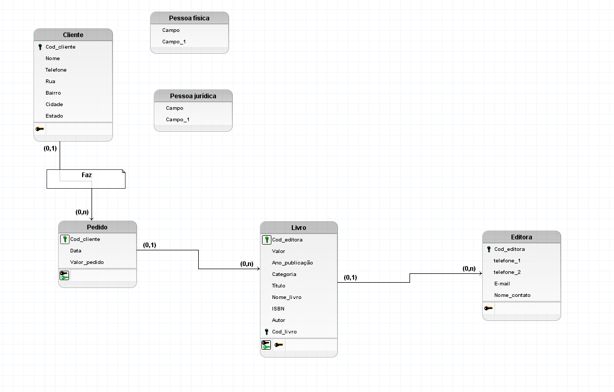
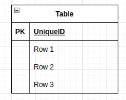
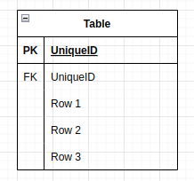
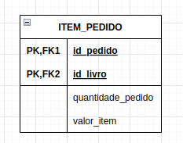
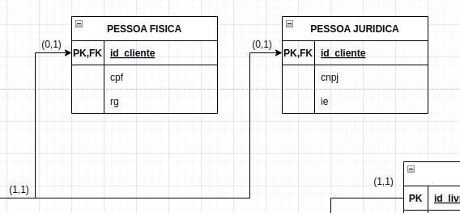

# 🤔 Modelo lógico

O modelo lógico de dados é criado a partir das descrições dos dados representadas em um modelo conceitual. Ele descreve como os dados serão armazenados no banco de dados, identificando as entidades, os atributos, as chaves primárias e estrangeiras e os seus relacionamentos.

### Entidades = Relação = Tabela

> Observação:
>
> Atributos multivalorados devem ser escrito duas vezes
>
> `ex:`
>
> `telefone(1,2)` = `telefone_1`, `telefone_2`

#### Entidades Fortes

- Serão identificadas pela presença de uma chave primária (`PK`).

#### Entidades Fracas

- Serão identificas pela presença de uma chave estrangeira (`FK`).

#### Entidades associativas

- Serão as "tabelas de ligação"

#### Atributo especialidade

