# Normalização

- O processo de normalizar um banco de dados é um fator muito importante que pode fazer uma diferença relevante na implementação e utilização de um banco de dados. Porém, existem casos em que normalizar os dados pode surtir um efeito contrário.

- A normalização dos dados é o processo utilizado para realizar a organização em um banco de dados. Ao realizar a normalização dos dados, alguns problemas podem ser evitados,como, por exemplo: eliminar a redundância dos dados, eliminar anomalias de inserção, atualização e exclusão.

- Com a normalização, a estrutura do banco de dados projetada inicialmente poderá sofrer alterações, como o surgimento de novas tabelas. Porém, este processo garante uma maior organização dos dados, reduzindo assim, a manutenção e desperdício do espaço de armazenamento.

- Para realizar a normalização algumas regras foram definidas. Essas regras são conhecidas como as formas normais e atualmente existem 5 formas normais que podem ser utilizadas no processo de normalização.

---

## Normalização em NoSQL

- O conceito de normalização não se aplica a todos os tipos de bancos de dados. Os bancos de dados **NoSQL**, por exemplo, normalmente armazenam dados não estruturados e possuem uma estrutura de armazenamento bem diferente dos bancos de dados relacionais.

- Normalmente o foco dos bancos de dados **NoSQL** é garantir uma maior velocidade de consulta, disponibilizando uma maior escalabilidade.Desta forma, as anomalias e redundância dos dados são toleradas em bancos de dados NoSQL.

---

# Tipos de normalização


## `1FN` - Primeira forma normal

requer que todos os valores de colunas em uma tabela, sejam atômicos (ex., um número é um átomo, enquanto uma lista ou um conjunto não o são). Por exemplo, a normalização elimina grupos repetidos pondo-os cada um em uma tabela separada, conectando-os com uma chave primária ou estrangeira.

- deve satisfazer as propriedades baseadas na dependência funcional.

- Gerar uma única tabela com colunas simples

- Chave primária : id de cada tabela aninhada

<details>
  <summary style="font-weight: bold;">Exemplos</summary>

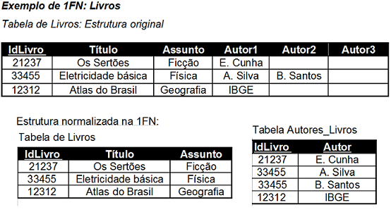

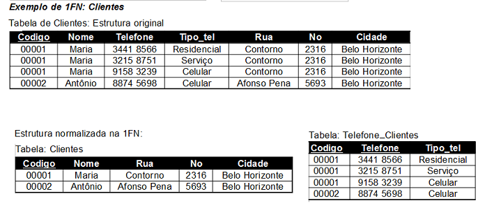

</details>

---

## `2FN` - Segunda forma normal

requer que não haja dependência funcional não-trivial de um atributo que não seja a chave, em parte da chave candidata.

- deve satisfazes a primeira forma normal

- deve satisfazer as propriedades baseadas na dependência funcional parcial.

- Geração de novas tabelas com Dependências Funcionais completas

- Análise de Dependências Funcionais:

    - tipo e descrição - DF de codp
    - nome, categ e salário - DF de code
    - data_início e tempo_aloc - DF de toda a chave

<details>
  <summary style="font-weight: bold;">Exemplos</summary>

```
Projetos(codp, tipo, descrição)
Empregados(code, nome, categ, salário)

ProjEmp(codp, code, data_início, tempo_aloc)
```

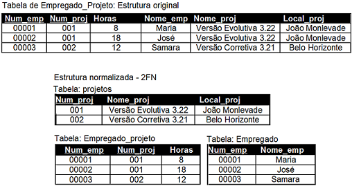

</details>

---


## `3FN` - Terceira forma normal 

- deve satisfazer a segunda forma normal

- deve satisfazer as propriedades baseadas na dependência transitiva.

- Geração de novas tabelas com Dependências Funcionais diretas

- Análise de DFs entre atributos não chave:

    - salário - Dependência Funcional de categ

<details>
  <summary style="font-weight: bold;">Exemplos</summary>

```
Projetos(codp, tipo, descrição)
Empregados(code, nome, categ)
ProjEmp(codp, code, data_início, tempo_aloc)

Categorias(categ, salário)
```

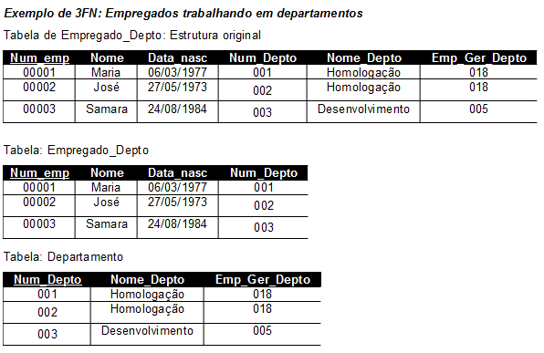

</details>

---

## `FNBC` - Forma normal de Boyce-Codd

Uma tabela está na FNBC quando todo atributo determinante existente na tabela é chave candidata”.

Requer que não exista nenhuma dependência funcional não trivial de atributos em algo mais do que um superconjunto de uma chave candidata. Neste estágio, todos os atributos são dependentes de uma chave, de uma chave inteira e de nada mais que uma chave (excluindo dependências triviais, como A → A);

- deve estar na terceira forma normal.

- todo atributo não chave precisa depender funcionalmente diretamente da chave, seja ela primária ou candidata.

- Na "tabela de ligação" a chave primaria vai ser a composição da das chaves estrangeiras .

<details>
  <summary style="text-weight: bold;">Exemplos</summary>

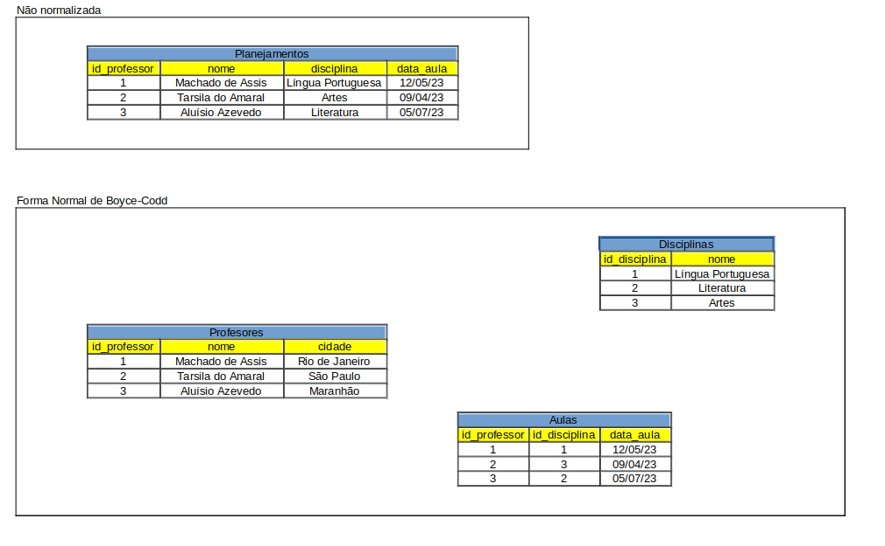

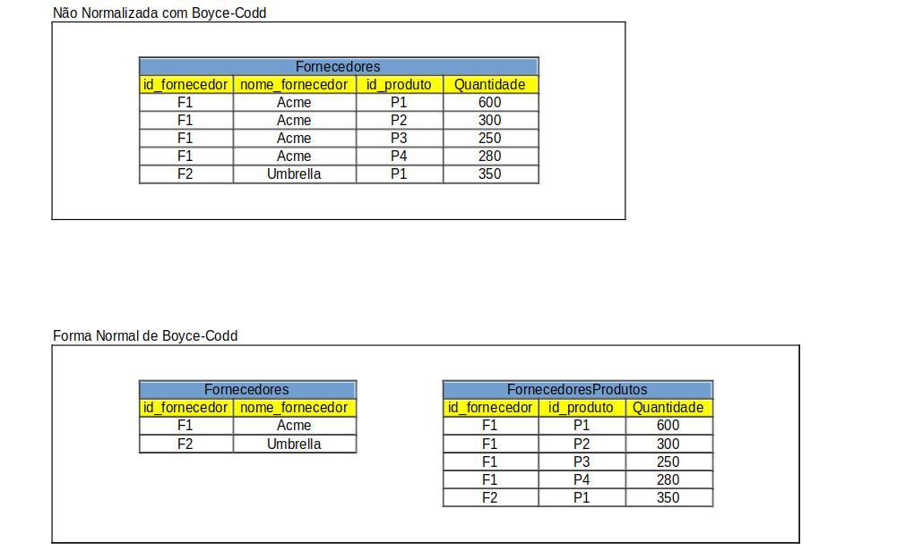

</details>

---

## `4FN` - Quarta forma normal

- deve estar na terceira forma normal.

- não possuir dependências multivaloradas.

- não deve satisfazer as propriedades baseadas na dependência Multivalorada.

<details>
  <summary style="text-weight: bold;">Exemplos</summary>

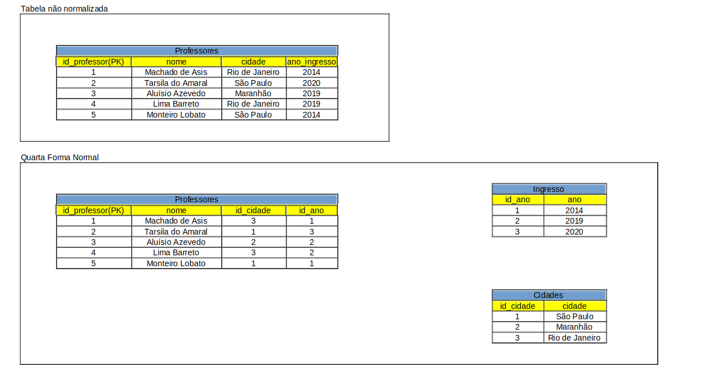

</details>

---

## `5FN` - Quinta forma normal

- Não possuir dependências de junção

- ser possivel a decomposição da tabela em subtabelas e reconstruilas.


<details>
  <summary style="text-weight: bold;">Exemplos</summary>


</details>

---

# [Tipos de dependências](http://www.bosontreinamentos.com.br/modelagem-de-dados/modelagem-de-dados-dependencias/)

## Dependências funcionais

Seja E uma entidade, e X e Y dois atributos quaisquer de E. Dizemos que Y é funcionalmente dependente de X se e somente se cada valor de X tiver associado a ele exatamente um valor de Y.

<code>
X -> Y
</code>

<br>

`X` determina funcionalmente `Y`

<details>
  <summary>Exemplo</summary>

Pensamos em uma tabela de pedidos; o prazo de entrega de um pedido depende do número do pedido considerado:

`Num_Pedido -> Prazo_entrega`

o atributo que determina o valor é chamado de *Determinante*(Num_Pedido). O outro pe chamado de *Dependente*(Prazo_entrega).

> **__OBS:__**
>
> Uma <span style="color: red;">chave primária(PK)</span> em uma relação determina funcionalmente todos os outros atributos não chave na linha.

</details>

---

## Dependência Funcional Total

Em uma relação com uma PK composta, um atributo não-chave que dependa dessa PK como um todo, e não somente de parte dela, é dito como possuindo Dependência Funcional Total.

<details>
  <summary>Exemplo</summary>

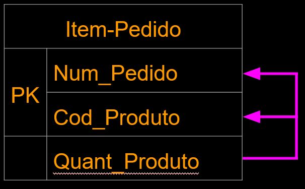

Quant_produto depende de ambas chaves primarias a qual é uma chave composta(Num_Pedido + Cod_Produto).

</details>

---

##  Dependência Funcional Parcial

Uma dependência funcional parcial ocorre quando os atributos não chave não dependam funcionalmente de toda a chave primária quando esta for composta. Assim, nas tabelas onde a chave primária for composta, todos os atributos devem depender de toda a chave primária. Caso a dependência seja de parte da chave, verificamos a existência de dependência funcional parcial.

<details>
  <summary>Exemplo</summary>

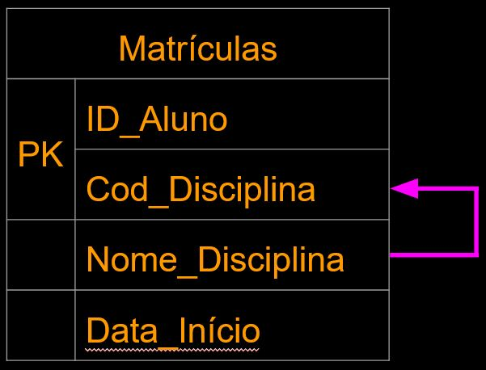

Campo Nome_Disciplina é dependente de Cod_Disciplina, mas não de ID_Aluno.

</details>

---

## Dependência Funcional Transitiva

Este tipo de dependência ocorre quando um campo não-chave não depende diretamente da chave primária da tabela (nem mesmo parcialmente), mas depende de um outro campo não-chave na tabela.

<details>
  <summary>Exemplo</summary>

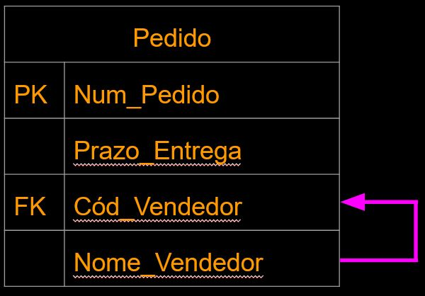

o atributo Nome_Vendedor depende funcionalmente do Cód_Vendedor, que não é chave primária na tabela. Já o campo Prazo_Entrega depende da PK, Num_Pedido

</details>

---

## Dependência Multivalorada

Ocorre quando, para cada valor de um atributo A, existe um conjunto de valores para outros atributos B e C que estão associados a ele, mas que são independentes entre si.

`A ->> B`

Onde `B` é a coluna que depende de `A`.

<details>
  <summary>Exemplo</summary>

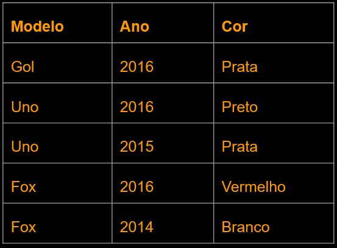

os atributos Ano e Cor são independentes entre si e dependem do modelo do carro. Essas duas colunas são dependentes multivaloradas do atributo Modelo.

</details>

## Dependência de Junção

utiliza os conceitos de decomposição sem perdas e de junção.

  - Se uma tabela T possui três atributos {a1, a2, a3};

  - Teremos três projeções possíveis para ela: T1: {a1, a2}, T2: {a1, a3}, T3: {a2, a3};

  - Dizemos que há uma dependência de junção se todas as linhas em T puderem ser formadas a partir da junção dessas três projeções simultaneamente. Ou seja, se a tabela T original puder ser decomposta em 3 tabelas menores T1, T2 e T3 (3-decomponível), as quais sejam originadas de suas projeções, teremos na tabela T o que chamamos dependência de junção.

  - Para representar que T tem dependência de junção com suas projeções, usamos esta forma: T*(T1,T2,T3).

<details>
  <summary>Exemplo</summary>

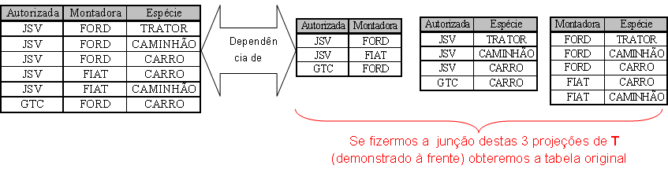

</details>

# Todos os links usados de suporte para escrita desse material.

|http://www.bosontreinamentos.com.br/modelagem-de-dados/modelagem-de-dados-dependencias/|
|:---:|
|https://www.estrategiaconcursos.com.br/blog/banco-dados-forma-normal/|
|https://www.gsigma.ufsc.br/~popov/aulas/bd1/index.html|
|https://sites.google.com/site/fkbancodedados1/normalizacao|
|https://www.devmedia.com.br/artigo-sql-magazine-7-formas-normais-superiores/7474|