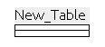
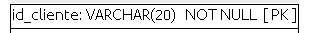
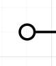
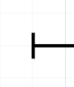
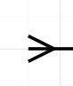

# 🚧 Modelo Físico

### Entidades = Relação = Tabela

### Atrributos = Colunas

### Cardinalidade

No modelo físico iremos usar o modelo "pé de galinha(chicken feet)".

No geral irão ficar iguais, só vai mudar as simbologias

Para especificar o mínimo e o maximo usaremos combinações.

- Zero

- Um

    - Caso não tem especificação será (1:1)

- Muitos

## Tipos

### Nos tipos de dados numéricos temos:

- `Int` - armazena valores numéricos inteiros.

- `Float`- armazena valores numéricos aproximados com precisão de ponto flutuante.

- `Decimal`-  armazena valores numéricos com casas decimais, utilizando precisão.

### Nos tipos de dados string temos:

- `Varchar` - armazena valores de string de tamanho variável de acordo com o seu limite.

- `Char` - armazena valores de string de tamanho fixo.

- `Text` - armazena valores de string de tamanho variável.

### Nos tipos de dados Data temos:

- `Date` - armazena apenas valores de data.

- `Time` - armazena apenas valores de hora.

- `Timestamp` armazena valores de data e hora.