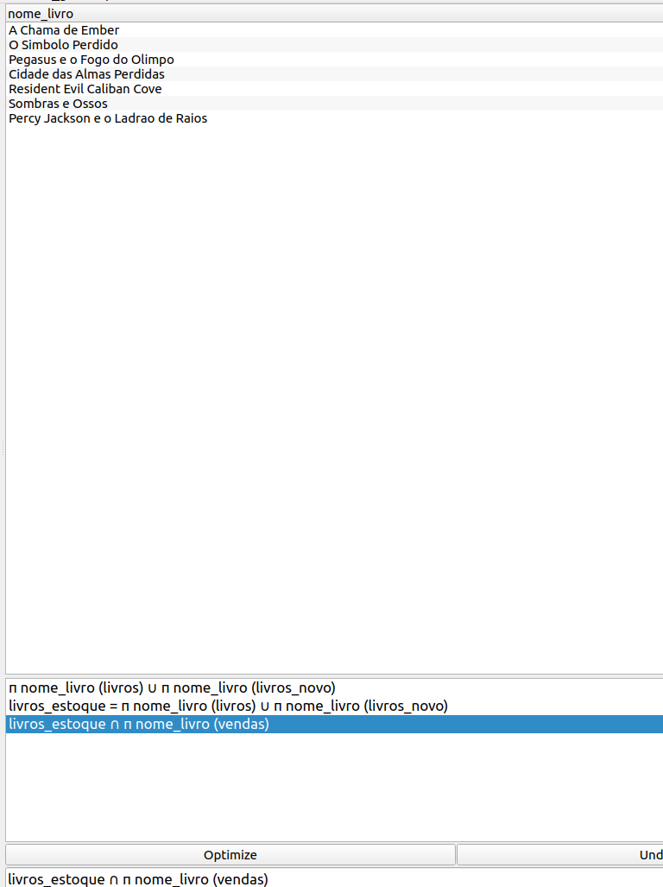

#  Álgebra Relacional

A álgebra relacional é uma derivação da álgebra de conjuntos em relação às operações. Ela ajuda a identificar os componentes de uma tupla por nome (chamado o atributo) ao invés de uma coluna de chaves numéricas, na qual é chamada a relação na terminologia de banco de dados.

Ela recebia pouca atenção até a publicação do modelo relacional de dados de E.F Codd, em 1970. Em junho desse mesmo ano, Codd publicou um artigo chamado Relational Model of Data for Large Shared Data Banks ("Modelo de dados relacional para grandes bancos de dados compartilhados") que foi publicado na Revista ACM ("Association for Computing Machinery") Vol. 13.

Este artigo demonstrou os fundamentos da teoria dos bancos de dados relacionais usando tabelas ("linhas" e "colunas") e operações matemáticas para recuperá-los destas tabelas (UNION, SELECT, SUM). Ou seja, Codd propôs a álgebra relacional como uma base para a linguagem SQL. Dessa forma, podemos dizer que o SQL é uma linguagem de consulta de banco de dados derivado da Álgebra Relacional.

> **__OBS:__**
>
> Toda demostração será feita usando o software [Relational](https://ltworf.github.io/relational/)

--- 

<h2 style="color: cyan;">Glossário</h2>

`tupla` - linha de uma tabela

`opr` - Alguma operação listada abaixo ou `tupla`.

`(R)` - Tabela

### `condição de seleção`:

`<nome_atributo><operador><valor_constante>`

- Clausulas

    - `<nome_atributo>`:

        Nome da coluna.

    - `<Operador>`

        Operador lógico.

        |Operador|Função|
        |:---:|:---:|
        |==|Igualdade|
        |<|Menor que|
        |>|Maior que|
        |<=|Menor ou igual a|
        |>=|Maior ou igual a|
        |!=|Diferente de|

    - `<valor constante>`

        \' \' - string contendo um valor

---

## Operadores em álgebra relacional.

|Função|Operador|
|:---:|:---:|
|Seleção|&sigma;|
|Projeção|&pi;|
|União|&cup;|
|Interseção|&cap;|
|Diferença|-|
|Plano Cartesiano|x|
|Junção|&#x2A1D;|
|Junção a Esquerda|&#x27D5;|
|Junção a Direita|&#x27D6;|

---

## <code>&sigma;</code> - Seleção:

É a operação usada para construir um subconjunto horizontal de uma relação, cujas tuplas satisfaçam uma determinada condição.

A operação selecionar seleciona tuplas que satisfazem um dado predicado. A operação de seleção é representada pela letra grega sigma (&sigma;). 

O predicado aparece após a letra sigma (`<condição_de_seleção>`) e a relação`(R)` é dada entre parêntese.

- Formula da operação de seleção:

    <code>&sigma; <condição_de_seleção> (R) </code>

    

      
Exemplo

    
    

    

    
> **Equivalência em SQL**
>
> `SELECT * FROM TABLE WHERE <CONDIÇÃO>`

## <code>&pi;</code> - Projeção

É a operação usada para construir um subconjunto vertical de uma relação, cujas tuplas satisfaçam uma determinada condição.

A operação projetar é uma operação que permite determinar quais atributos da relação devem ser apresentados como resultado da operação seleção, ou seja, permite deixar de fora algumas colunas/atributos de uma relação.

A projeção é representada pela letra grega pi (&pi;). Os atributos da relação que devem ser apresentados no resultado aparecem apos a letra pi (&pi;) e a relação é dada entre parêntese.

- Formula da operação de Projeção.

    <code>&pi; <condição_de_seleção> (R) </code>

    

      
Exemplo

    

    

> **Equivalência em SQL**
>
>`SELECT (<FIELD_1>, <FIELD_2>, ...) FROM <TABLE>`

## <code>&larr;</code> - Atribuição

Em álgebra relaciona o processo de atribuição é feito usando <code>&larr;</code>, no `Relational` é usado um `=` para atribuição

<code>x &larr; opr </code>

<code>x = opr</code>

# &cup; - União 

A união de duas relações A e B é o conjunto de todas as tuplas pertencentes a relação A ou pertencentes a relação B.

As relações devem possuir o mesmo número de atributos e os atributos das relações diferentes devem possuir o mesmo domínio.

- Formula de união:

    <code>opr &cup; opr </code>

    

      
Exemplo

    

    

> **Equivalência em SQL**
>
> SELECT column_name(s) FROM table1
UNION
SELECT column_name(s) FROM table2;

# &cap; - Interseção

A intersecção de duas relações A e B é o conjunto de todas as tuplas pertencentes a relação A e pertencentes a relação B.

- Formula de Interseção

    <code>opr &cap; opr</code>

    

      
Exemplo

    

    

> **Equivalência em SQL**
>
> SELECT expression1, expression2, ... expression_n
FROM tables
[WHERE conditions]
INTERSECT
SELECT expression1, expression2, ... expression_n
FROM tables
[WHERE conditions];

# &minus; - Diferença

A diferença de duas relações A e B é o conjunto de todas as tuplas pertencentes à relação A e não pertencentes à relação B.

- Formula de diferença

    <code>opr - opr</code>

    

      
Exemplo

    

    

> **Equivalência em SQL**
>
> SELECT * FROM TABLE_NAME WHERE COLUMN1_NAME=COLUMN2_NAME;

# &chi; - Plano cartesiano

O produto cartesiano de duas relações A e B é o conjunto de todas as tuplas originadas da combinação das tuplas pertencentes a A e das tuplas pertencentes a B.

- Formula de plano cartesiano

    `opr * opr `

    

      
Exemplo

    

    

# &#x2A1D; - Junção

A operação de junção nada mais é do que uma operação de um produto cartesiano seguido de uma operação de seleção que pode ser representada em uma única operação.

A operação de junção é representada através do sinal ⋈ e combina tuplas relacionadas de duas relações em uma única tupla. Trata-se de um das principais operações em um banco de dados relacional, já que permite fazer o relacionamento entre as relações.

A junção só é possível a partir da existência de um atributo comum entre as duas relações que se deseja fazer o relacionamento. Normalmente este atributo é uma chave estrangeira que foi propositalmente incluída em uma relação para se relacionar com a chave principal de uma outra relação.

combina tuplas as quais tenham campo com mesmo nome, caso não tenha fica igual ao plano cartesiano.

- Formula de junção

  <code>opr &#x2A1D; opr </code>

  

    
Exemplo

    

  

> **Equivalência em SQL**
>
> __Inner Join__
>
> SELECT column_name(s)
FROM table1
INNER JOIN table2
ON table1.column_name = table2.column_name;

# &rho; - Renomeação

- Formula de renomeação

  &rho; rename &rArr; name (table)

# &#x27D5; - Junção á esquerda

toma todas as tuplas da relação à esquerda que não
encontraram par entre as tuplas da relação à direita, preenche a tupla com valores nulos para
todos os outros atributos da relação à direita e a adiciona ao resultado da junção natural. Todas as
informações da relação à esquerda são apresentadas no resultado da junção externa à esquerda.

- Formula de junção á esquerda

  <code>opr &#x27D5; opr</code>

  

    
Exemplo

  

  

> Equivalência em SQL
>
> __Left Join__
>
> SELECT column_name(s)
FROM table1
LEFT JOIN table2
ON table1.column_name = table2.column_name;

# &#x27D6; - Junção à direita

é simétrica à junção externa à esquerda: as tuplas da
relação à direita que não encontraram par na relação da esquerda são preenchidas com nulos e
adicionadas ao resultado da junção natural. Assim, todas as informações da relação da direita se
apresentam no resultado da junção externa à direita.

- Formula de junção á direita

  <code>opr &#x27D6; opr</code>

  

    
Exemplo

  

  

> **Equivalência em SQL**
>
> __Right Join__
>
> SELECT column_name(s)
FROM table1
RIGHT JOIN table2
ON table1.column_name = table2.column_name;

